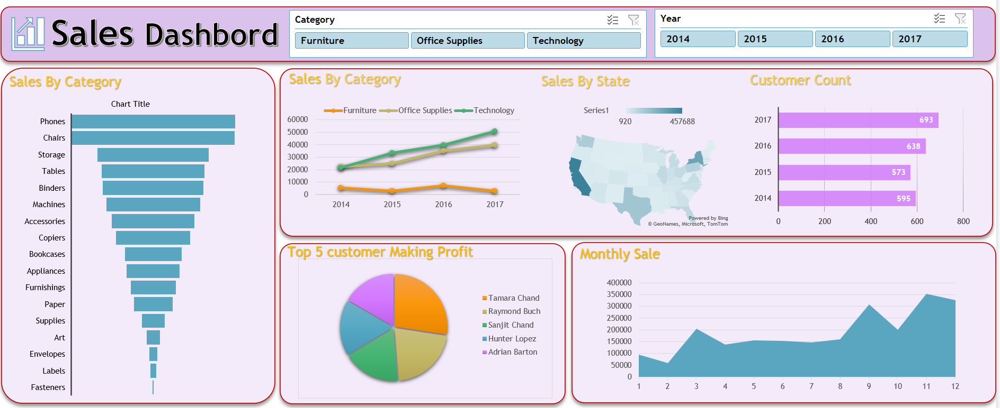

     
# 🧾 Sales Data Analyasis

_This dashboard gives a clear and simple overview of sales performance, showing important details like total sales, profit, and trends over time._

---

## 📌 Table of Contents
- <a href="#overview">Overview</a>
- <a href="#business-problem">Business Problem</a>
- <a href="#dataset">Dataset</a>
- <a href="#tools--technologies">Tools & Technologies</a>
- <a href="#project-structure">Project Structure</a>
- <a href="#data-cleaning--preparation">Data Cleaning & Preparation</a>
- <a href="#exploratory-data-analysis-eda">Exploratory Data Analysis (EDA)</a>
- <a href="#research-questions--key-findings">Research Questions & Key Findings</a>
- <a href="#dashboard">Dashboard</a>
- <a href="#how-to-run-this-project">How to Run This Project</a>
- <a href="#final-recommendations">Final Recommendations</a>
- <a href="#author--contact">Author & Contact</a>

---
<h2><a class="anchor" id="overview"></a>Overview</h2>

This dashboard provides a complete overview of business performance by summarizing key metrics like sales, profit, and growth trends in one place.
It visually highlights top-performing products, regions, or categories, making it easier to track progress and identify areas that need improvement.
---
<h2><a class="anchor" id="business-problem"></a>Business Problem</h2>

Here is the business problem explained in clear points:
- Declining or inconsistent sales performance over time.
- Low profit margins despite high sales revenue.
- Certain products or categories not performing well.
- Uneven sales across different regions or markets.
- Over-dependence on a few customers or products.
- High discount rates reducing overall profitability.
- Inventory not moving fast enough (slow-selling products).
- Lack of clear insights for making quick, data-driven decisions.

---
<h2><a class="anchor" id="dataset"></a>Dataset</h2>

- Multiple CSV files stored in the /data/ folder (Sales, Store, Inventory), containing raw transactional and operational data.
- Data from these files was cleaned, combined, and processed to create a structured summary table.
- The summary table is used for analysis, reporting, and building the dashboard to track business performance.
---

<h2><a class="anchor" id="tools--technologies"></a>Tools & Technologies</h2>

- Microsoft Excel
- Pivot Tables
- Charts & Graphs
- GithHub

---
<h2><a class="anchor" id="project-structure"></a>Project Structure</h2>

```
sales-data-analysis/
│
├── README.md
├── requirements.txt
├── Sales Data Report .pdf
│
├── dashboard/                  # Excel Dashboard File
│   └── sales_store_dashboard.XLSX
```

---
<h2><a class="anchor" id="data-cleaning--preparation"></a>Data Cleaning & Preparation</h2>

- Removed duplicate records and handled missing values.
- Standardized data formats (dates, currency, text) and corrected errors.
- Converted appropriate data types (text to date, string to numeric).
- Removed invalid values and treated outliers.
- Created calculated columns and derived new features (Month, Year, KPIs).
- Built summary tables and structured the final dataset for dashboard analysis.

---
<h2><a class="anchor" id="exploratory-data-analysis-eda"></a>Exploratory Data Analysis (EDA)</h2>

**Negative or Zero Values Detected:**
- Negative sales values indicate possible returns or data entry errors.
- Zero/negative quantity shows missing data or inventory recording issues.

**Outliers Identified:**
- Extremely high sales values detected, which may impact overall analysis results.
- Unusual quantity or profit values found, indicating possible data entry errors or exceptional transactions.

**Correlation Analysis:**
- Strong positive correlation found between Sales and Profit.
- Weak correlation observed between Discount and Profit.
  
---
<h2><a class="anchor" id="research-questions--key-findings"></a>Research Questions & Key Findings</h2>

1. **Which month generated the highest sales revenue?
2. **Which product category contributes the most to total revenue?
3. **Which region/state performs best in terms of sales?
4. **What is the relationship between discounts and sales volume?
5. **Who are the top customers contributing to revenue?

---
<h2><a class="anchor" id="dashboard"></a>Dashboard</h2>

- Excel Dashboard shows:
  - Monthly sales and order trends
  - Top performing states by revenue
  - Sales distribution by gender and age group
  - Orders by different sales channels
  - Order status breakdown (Delivered, Cancelled, Returned, Refunded)
  

---     
<h2><a class="anchor" id="how-to-run-this-project"></a>How to Run This Project</h2>

1. Clone the repository:
```bash
git clone https://github.com/yourusername/sales-data-analysis.git
```
3. Load the CSVs and ingest into database:
```bash
sales_dashboard_excel.xlsx  
```
4. Create sales summary table:
```bash
excel scripts/get_sales_summary.xlsx
```
5. Open Excel Dashboard:
   - `dashboard/vrinda_sales_dashboard.pbix`

---
<h2><a class="anchor" id="final-recommendations"></a>Final Recommendations</h2>

- Focus marketing campaigns on peak season months to maximize revenue.
- Invest more in top-performing product categories to increase profitability.
- Expand strategy in high-performing regions and improve sales in low-performing areas.
- Offer optimized discounts (avoid heavy discounts that reduce profit).
- Build customer retention programs to encourage repeat purchases and loyalty.
---
<h2><a class="anchor" id="author--contact"></a>Author & Contact</h2>

**Vikas Siddheshware**  
Data Analyst       
📧 Email: vikassiddheshware2001@gmail.com  
🔗 [LinkedIn](www.linkedin.com/in/vikas-siddheshware)  

